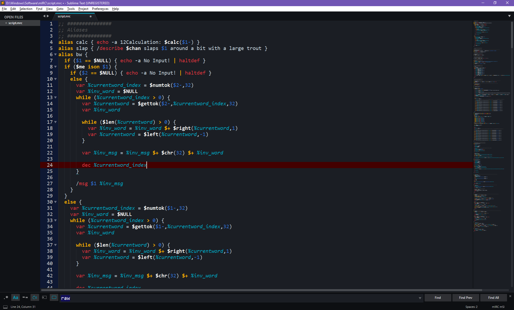

# mIRC-Scripting-Language-for-Sublime-Text
Updated for mIRC 7.52 (March 2018)

This is my attempt at creating a Sublime Text 3 syntax highlighter for mIRC scripting language.  All $vars and /commands listed in the mIRC help file index should be parsed.  Some undocumented $vars and /commands may be parsed, but I'm sure there's a few that I missed.  Create an issue if any keywords/commands are missing.

- User $variables and mIRC $variables are styled separately.
- User /commands and mIRC /commands are styled separately.
- User .commands and mIRC .commands are styled separately.
- on* and raw events are styled.
- Both ; and /* comments are parsed.

Regex is a little rudimentary, but should work in most cases.  Create a new issue if you encounter any errors and I will try to correct.

To install:

1. Copy mIRC-msl.sublime-syntax to Sublime\Data\Packages\User folder.

You may need to create the Packages\User folder.

