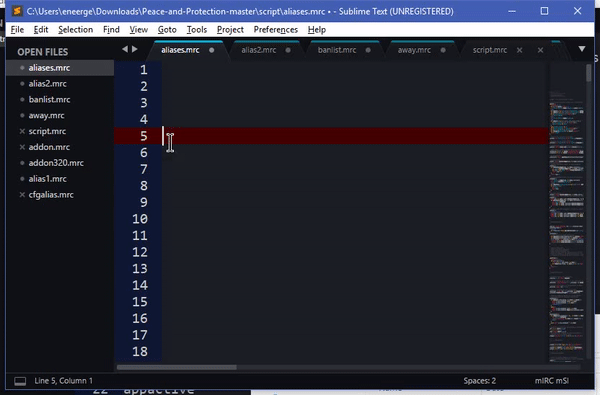

# mIRC-Scripting-Language-for-Sublime-Text
Updated for mIRC 7.52 (March 2018)

- NEW: Autocompletions - Currently auto completes /commands.  I am working on $identifiers

This is my attempt at creating a Sublime Text 3 syntax highlighter for mIRC scripting language.  All $vars and /commands listed in the mIRC help file index should be parsed.  Some undocumented $vars and /commands may be parsed, but I'm sure there's a few that I missed.  Create an issue if any keywords/commands are missing.

Highlighting
---------------
Highlighting currently supports all commands and identifiers in mIRC.  In addition "on/ctcp/raw events" will also highlight.  I try to cover all cases including: commands on new line, commands inline, commands after a |, commands after a {, etc.  I welcome any suggestions for improvement.

Auto Completion
---------------
Autocomplete will work for /commands and $identifiers.  All commands are available.  Identifiers will be added shortly.

Auto Completion - Syntax Assistance
-----------------------------------
In addition to autocompleting commands and identifiers, there will also be a "syntax-" option that can aid you in the development process by doing one or both of the following:
1. HelpAssist - Print the syntax/help of the command or identifier
2. Building - Enable Tabbing through fields of the command/identifier enabling you to "build" the command

Syntax "HelpAssist" is currently limited to "abook through bcopy" (alphabetical) commands.  I am working on adding more.
Command "Building" is currently limited to "aline".

Bugs
---------------
Let me know if you find any bugs by submitting an Issue.

Installation
------------

1. Copy mIRC-msl.sublime-syntax to Sublime\Data\Packages\User folder.
2. Copy mIRC-msl.sublime-completions to Sublime\Data\Packages\User folder.

You may need to create the Packages\User folder.

A slightly modified theme has been provided in the Extras folder that supports all features of the highlighter. Themes should support the following scopes to support all styles of this highlighter:
1. comment.line.double-slash
2. constant.numeric
3. constant.numeric.line-number.find-in-files
4.entity.name.class
5. entity.name.function
6. entity.name.tag
7. Keyword.control
8. keyword.operator
9. punctuation.definition.comment
10. string
11. variable.parameter

